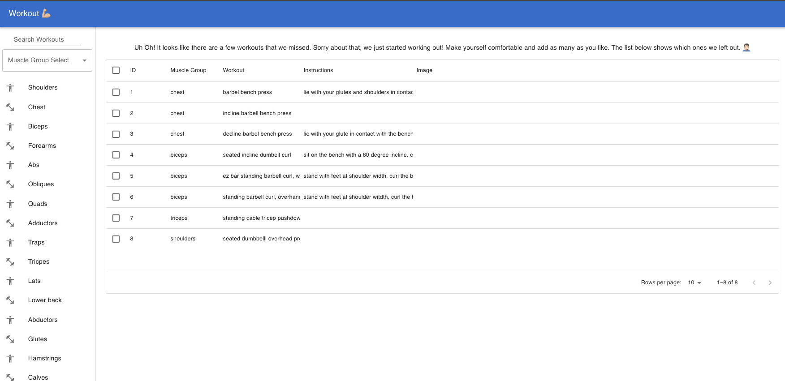

# This create-react-app is a simple implementation of Redux Toolkit (RTK).

The way it is setup the store contains 3 variables used in the application:

- The rows displayed on the table
- The text used to search for a specific workout
- The text used to filter for muscle group

